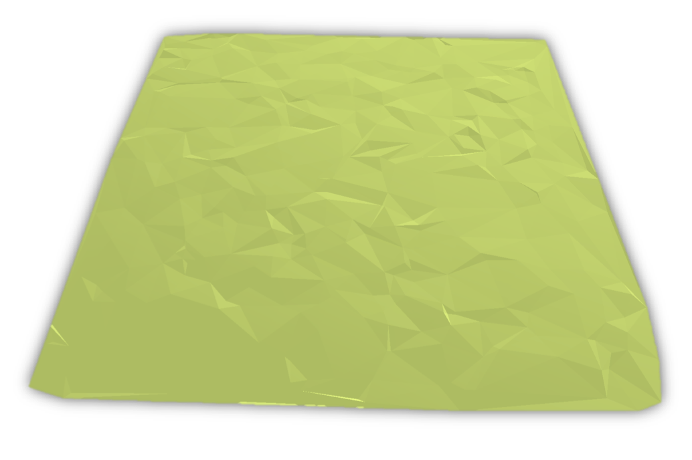
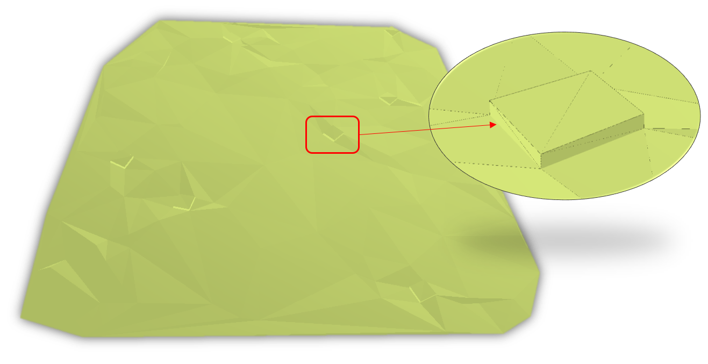
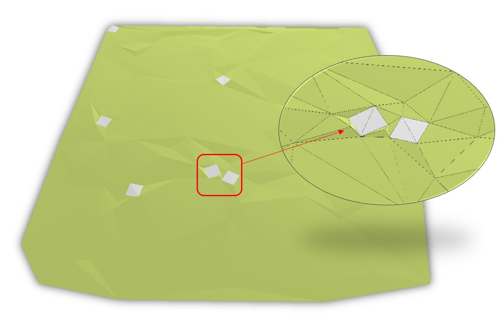
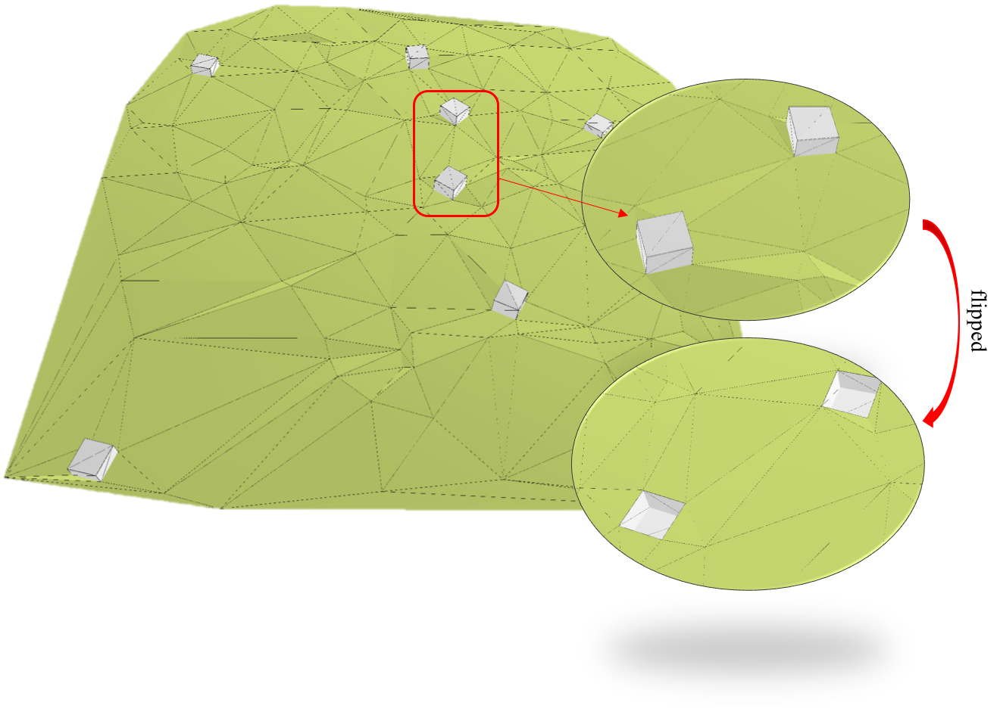

# Random3DTIN
A python utility to generate terrain models as TINs at different LODs in CityGML.

Things to know
---------------

### Level of Detail (LOD) modelling for terrains in CityGML

The concept of Level of Detail (LOD) is an important characteristic of a 3D city model. One implementation of the LOD concept can be seen in the international 3D GIS standard CityGML version 2.0 by the OGC.

CityGML defines 5 LODs for the city objects.
The concept is well defined for buildings, bridges, tunnels, and to some extent for roads. However, there is no clear definition of LODs for terrain/relief, vegetation, land use, water bodies, and generic city objects in CityGML. Extensive research has been done to refine the LOD concept of CityGML but it is mostly done for buildings. There is no widely-accepted LOD paradigm for terrains in 3D city modelling. There are no guidelines provided that differentiates between the 5 LODs for the terrains at geometry and semantic level.

### Our framework for TIN terrain LODs in CityGML

| LOD  | Visualization | Description |
| ------------- | ------------- | ------------- |
| LOD1  |  | LOD0 = a strict 2.5D TIN representation.|
| LOD2  |  | LOD1 = LOD0 + information about the vertical triangles and overhangs in the TIN. |
| LOD3  |  | LOD2 = LOD0 + information about the city objects integrated in the terrain. |
| LOD4  |  |LOD3 = LOD1 + information about the city objects integrated in the terrain.|


System requirements
---------------------

### Python packages:

+ [lxml](http://lxml.de)
+ [argparse](https://docs.python.org/3/library/argparse.html)
+ [triangle](https://pypi.org/project/triangle/)
+ [uuid](https://docs.python.org/3/library/uuid.html)
+ [shapely](https://pypi.org/project/Shapely/)

### OS and Python version

The software has been developed on MacOS in Python 3.7, and has not been tested with other configurations and platforms.

How to use?
-----------

```
python3 random3dtin.py -n /numberOfPoints/ -o /pathToOutputFile/ -t0/1/2/3 1
```

For instance, to generate an LOD0 CityGML terrain model, use the following command:

```
python3 random3dtin.py -n 100 -o /path/to/outputfile/ -t0 1
```


Note:

+ CityGML 2.0 datasets are generated
+ Only Building, Relief (Terrain) and Generics classes are supported
+ Output files must end with `.gml`, `.GML`, `.xml`, or `.XML`


### Coming soon
Support for converting features such as Roads, Railways, Water bodies, vegetation, etc. will be available soon.

Conditions for use
---------------------
This software is free to use. You are kindly asked to acknowledge its use by citing it in a research paper you are writing, reports, and/or other applicable materials.
